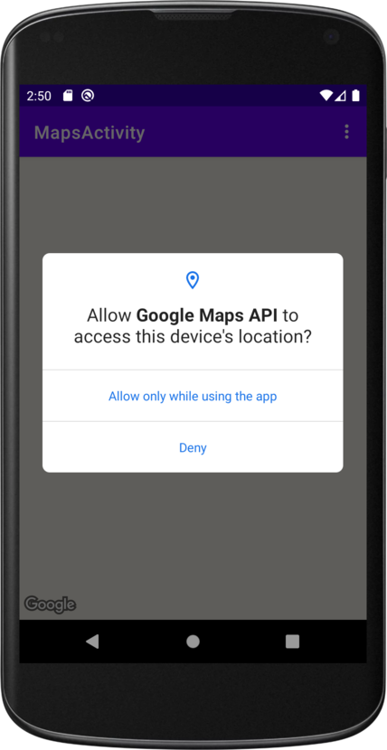
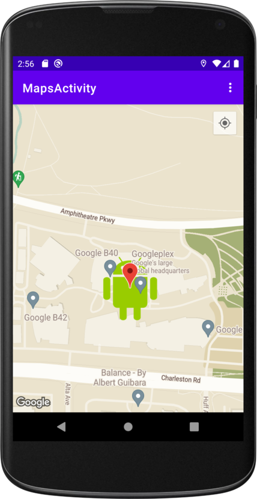
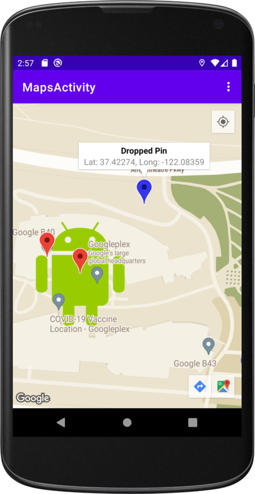
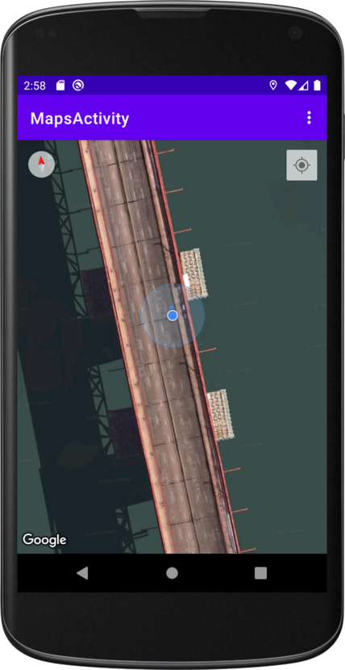

# Google Maps API 🌐

Project created for the Udacity nanodegree Android Kotlin Developer program.

## Features ✨

- Permissions
- Google Maps API
- API KEY
- Style Maps
- POI
- Location Tracking

## Project Milestones

- Obtain an API key
- Integrate a Google Map in app
- Display different map types
- Style the Google Map
- Add markers to map
- Enable the user to place a marker on a point of interest (POI)
- Enable location tracking

## Installation

Please add your Google Maps API KEY to the local.properties

```sh
# Google Maps API key
MAPS_API_KEY=<YOUR_API_KEY>
```

## Overview

In this project Google Map API was implemented. Added markers programmatically, on long click, and on POI click. I also learned how to style Google map and enable location tracking.




